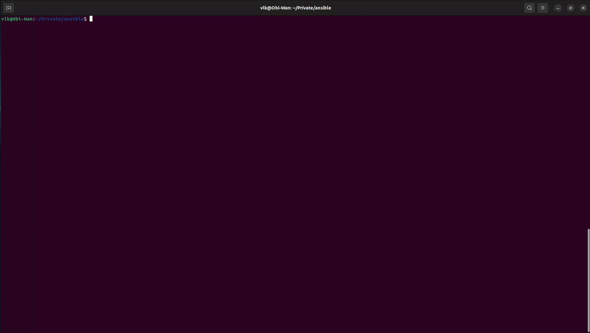

# Ansible Parser

The following documentation includes an Ansible playbook to extract basic information from server based machines, and a Python Script that extracts and processes the information to generate a CSV file. This information includes the domain name, any IPv4 and IPv6 that the machine uses and the MAC Addresses. Then the Script tries to define the IPv4 network the machine belongs to.



## Ansible Installation

```
sudo apt-get update
sudo apt install software-properties-common
sudo add-apt-repository --yes --update ppa:ansible/ansible
sudo apt-get install ansible sshpass -y
```

## Host Machine Configuration

On the host machine that will execute Ansible,  edit `/etc/ansible/hosts` and add the IPs of the machines that Ansible will extract information from. 

Specify the user, and for SSH the service port in case it's not the default.

+ Linux

If the remote machines OS is based on Linux, add the following lines.

```
[linux]
10.1.x.x ansible_user=user ansible_port=111111
10.1.x.x ansible_user=root ansible_port=111111

[linux:vars]
ansible_ssh_extra_args="-o PasswordAuthentication=no"
```

+ Windows

For Windows machines, add the following lines.

```
[win]
10.1.x.x
10.1.x.x

[win:vars]
ansible_user=user
ansible_connection=winrm
ansible_winrm_server_cert_validation=ignore
```

## Linux Machines Configuration

For Ansible to be able to execute the playbooks on a Linux remote machine, it only needs to have Python and SSH server installed. 

+ FreeBSD

  To execute Ansible on a remote FreeBSD based machine, like pfSense or OPNsense, it needs `/usr/bin/python` to exist. For that, access the remote machine and create a symbolic link before executing Ansible.

  ```
  ln -s /usr/local/bin/python3.8 /usr/bin/python
  ```

## Windows Machines Configuration

For Ansible to be able to execute on a Windows remote machine through a secure connection, WinRM needs to be setup. 

This is the service used by Ansible to communicate with Windows machines with an SSL certificate to encrypt the communication. WinRM executes the playbooks through the Powershell.

The installation can be done by executing the following command in the Powershell, that will download a Script.

```
Invoke-WebRequest -OutFile script.ps1 -Uri https://raw.githubusercontent.com/ansible/ansible/devel/examples/scripts/ConfigureRemotingForAnsible.ps1
```

Then execute the Script to install WinRM.

```
.\script.ps1

```

The following command deletes the Script.

```
Remove-Item script.ps1
```

WinRM opens two ports on the Windows Machines, one used for HTTP communication without encryption (port 5985), and another with encryption (port 5986).

The following command closes the port without encryption on the Firewall of the machine.

```
New-NetFirewallRule -DisplayName "Drop http for winrm - in" -Direction Inbound -LocalPort 5985 -Protocol TCP -Action Block
```

## Access

Ansible only intakes one password, so if the remote machines have different passwords, the playbook will fail to execute on those machines.

The solution for Linux remote machines is to generate an ssh-key and copy it into the remote machines, that away the playbook can access and execute the playbook without needing a password.

For Windows remote machines, there is a way to setup client certificate authentication for WinRM. The process is somewhat complicated, but the following [link](https://github.com/jijiechen/winrm-client-certificate-auth) contains Scripts to automate the process.

In case client certificate authentication for WinRM is not setup, the playbook will use a variable prompt on execution to store the Windows remote machine password and use ssh-key for Linux remote machines.

## Playbook

Create a playbook named [system_info.yml](./system_info.yml) that will extract useful information from the machines.

Basically, it uses the ansible_facts gathered automatically on the host executing the playbook and properly print the information we need.

The facts being diferent for Linux and Windows machines, the playbook gets the information in a different way depending on the OS family.

```
---
 - hosts: all
   vars_prompt:
    - name: ansible_password
      prompt: Enter password
      private: yes 
   vars:
    ipv4_addresses: []
    ipv6_addresses: []
   tasks:
   - name: hostname
     debug:
       var=ansible_hostname

   - name: date and time
     vars:
      msg: |
       Date: {{ ansible_date_time.date }}
       Timezone: {{ ansible_date_time.tz }}
     debug:
      msg: "{{ msg.split('\n') }}"

   - name: get ip address
     ansible.builtin.set_fact:
      ipv4_addresses: "{{ipv4_addresses + [item] if item is not search(':') else ipv4_addresses}}"
      ipv6_addresses: "{{ipv6_addresses + [item] if item is search(':') else ipv6_addresses}}"
     loop: "{{ansible_ip_addresses}}"
     when: ansible_os_family == 'Windows'

   - name: network info
     vars:
      msg: |
       All Interface List: {{ ansible_interfaces if ansible_os_family != 'Windows' else ansible_interfaces | map(attribute='connection_name') | flatten}}
       All IPv4: {{ ansible_all_ipv4_addresses if ansible_os_family != 'Windows' else ipv4_addresses }}
       All IPv6: {{ ansible_all_ipv6_addresses if ansible_os_family != 'Windows' else ipv6_addresses }}
       Gateway: {{ ansible_default_ipv4.gateway | default('None') if ansible_os_family != 'Windows' else ansible_interfaces | map(attribute='default_gateway') | flatten | first | default('null')}}
     debug:
       msg: "{{ msg.split('\n') }}"

   - name: mac info
     debug:
       msg: "{{ ansible_interfaces | difference(['lo']) | map('regex_replace', '^(.*)$', 'ansible_\\1' ) | map('extract', hostvars[inventory_hostname], 'macaddress') | list if ansible_os_family != 'Windows' else ansible_interfaces | map(attribute='macaddress') | flatten}}"

   - name: OS and Kernel info
     vars:
      msg: |
       Distribution: {{ ansible_distribution}}
       Release: {{ ansible_distribution_release | default("None")}}
       Distribution Version: {{ ansible_distribution_version | default("Unreachable") }}
       Kernel: {{ ansible_kernel }}
       Architecture: {{ ansible_architecture }}
     debug:
      msg: "{{ msg.split('\n') }}"


   - name: HW info
     vars:
      msg: |
       CPU: {{ ansible_processor}}
       CPU Core: {{ ansible_processor_cores if ansible_os_family != "Windows" else ansible_processor_vcpus}}
       RAM: {{ ansible_memtotal_mb}}
       SWAP: {{ ansible_memory_mb.swap.total | default("None")}}
     debug:
      msg: "{{ msg.split('\n') }}"
```

## Output

Execute the following command to save the output in the correct format.

```
ansible-playbook /home/vlk/Downloads/system_info.yml > output.json
```

## Script

+ [ansible_parser.py](./ansible_parser.py)

Before executing the Script, make sure to define the various fields to be used on the CSV file.

+ Ex:

```
tabletipe = dict([('ID.GA-1', 'Número de inventário;Nome/Modelo do equipamento;Número de série;Localização;Endereço IPv4;Endereço IPv6;Endereço de hardware;Nome;Contacto:;Departamento;Criticidade*')])
```

Define a list with the Network names.

+ Ex:

```
network_names = ('Network_1', 'Network_2') 
```

Define a dictionary of the Network names and the Network Ranges.

+ EX:

```
network_range = dict([('Network_1', ('10.1.1.0', '10.1.1.63')), ('Network_2', ('10.1.1.64', '10.1.1.71'))])
```

Lastly, modify in which order the fields will be written to correspond with the fields defined for the table.

+ EX:

```
writer.writerow(["", domain, "", "Data Center", ipv4, ipv6, mac, "", "", network, ""])
```

The `domain` variable contains the Domain name, `ipv4` the IPv4 address, `ipv6` the IPv6 address, `mac` the MAC Addresses and `network` the Network name.

To invoke the Script, execute the following command.

```
python3 ansible_parser.py input.file output.csv
```

### Network Structure

In some cases, it may happen that in a Network range there is another Network or two inside that range.

+ EX:

```
network_range = dict([('Network_1', ('172.23.0.0', '172.23.255.255')), ('Network_2', ('172.23.7.0', '172.23.7.255')), ('Network_3', ('172.23.16.0', '172.23.17.255')), ('Network_4', ('172.24.4.0', '172.24.4.255'))])
```

Make sure that when defining the `network_names` and `network_range` variables that the Networks inside another Network range go immediately after it, like on the example.

In those cases, we need to adapt the following function on the script in order for it to work correctly.

```
def ListThem(ip, rede):
    for z in ip:
        for i in range(0, len(network_names)):
            x = tuple(network_range[network_names[i]])
            if check_ipv4_in(z, *x) == True:

                if network_names[i] == 'Network_1':
                    w = tuple(network_range[network_names[i + 1]])
                    y = tuple(network_range[network_names[i + 2]])

                    if check_ipv4_in(z, *w) == True:
                        rede[z] = network_names[i + 1]
                        break
                    
                    elif check_ipv4_in(z, *y) == True:
                        rede[z] = network_names[i + 2]
                        break
                    
                    else:
                        rede[z] = network_names[i]
                        break
                
                elif network_names[i] != 'Network_1' and network_names[i] != 'Network_2' and network_names[i] != 'Network_3':
                    rede[z] = network_names[i]
                    break   
            else:
                rede[z] = ""
```

In the `ListThem` function that lists the Networks and calls the `check_ipv4_in` function to compare the IP with the Network range to identify if that IP belongs to that Network, we need to add an if condition to check the Network name. 

If the Network name matches the Network with another Network or two inside that range, it will create two variables (`w` and `y`) in this case, with the next two Network names, then it will compare the IP with those Network ranges to see if it belongs to one of them.

Lastly, if the two conditions return false, it will compare the IP with the original Network range.

Else, if the Network name does not match the Network with another Network or two inside that range, and the Network name does not belong to one of the other two Networks, it will execute normally.

Make sure to change the Network names, and create as many variables depending on how many Networks are inside that Network range.
